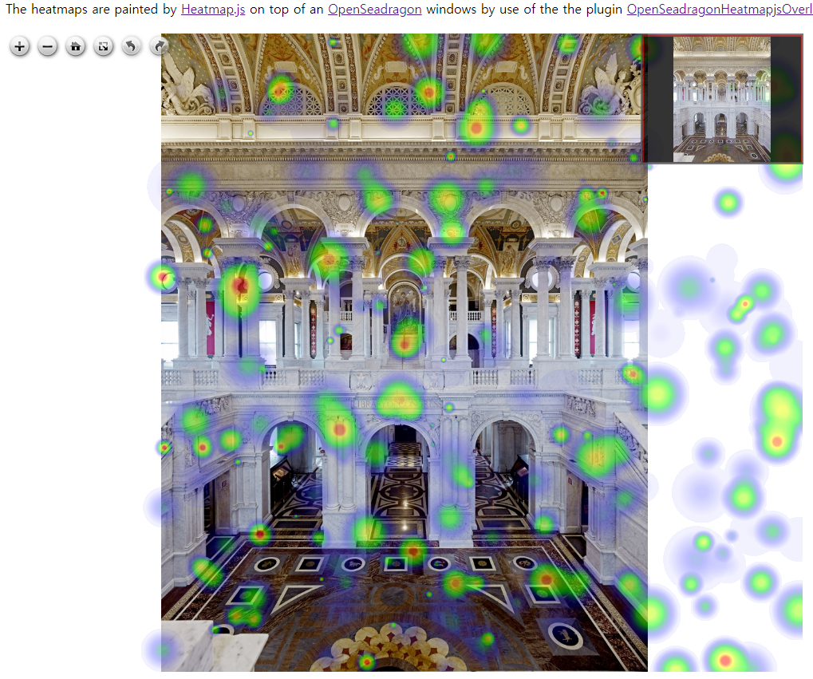

# openseadragonHeatmapjsOverlay

This plugin allows you to show [heatmaps used heatmap.js](https://www.patrick-wied.at/static/heatmapjs/) over [OpenSeadragon](https://openseadragon.github.io/) deep zoom images.

[online demo](https://choikyusu.github.io/openseadragonHeatmapjsOverlay/views/heatmap.html)




# local 환경 구성하기

local 환경 구성을 위해서는 node 12버전 이상을 설치해야합니다.

### 관련 라이브러리 설치

```sh
npm install
```
### local 서버 실행

```sh
npm start
```
or
```sh
node app.js
```

http://localhost:3000 으로 접속하면 화면을 볼 수 있습니다.
